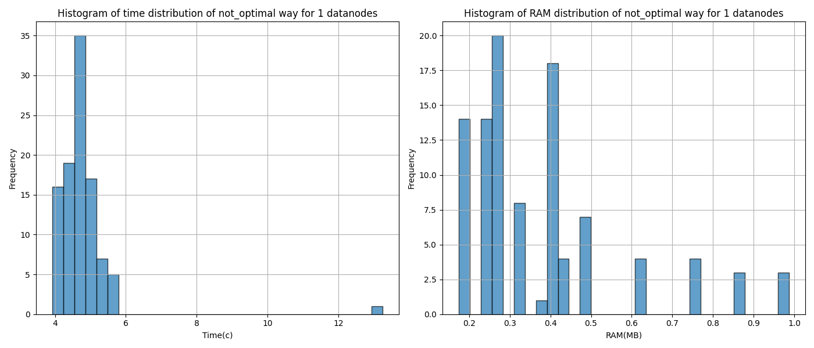
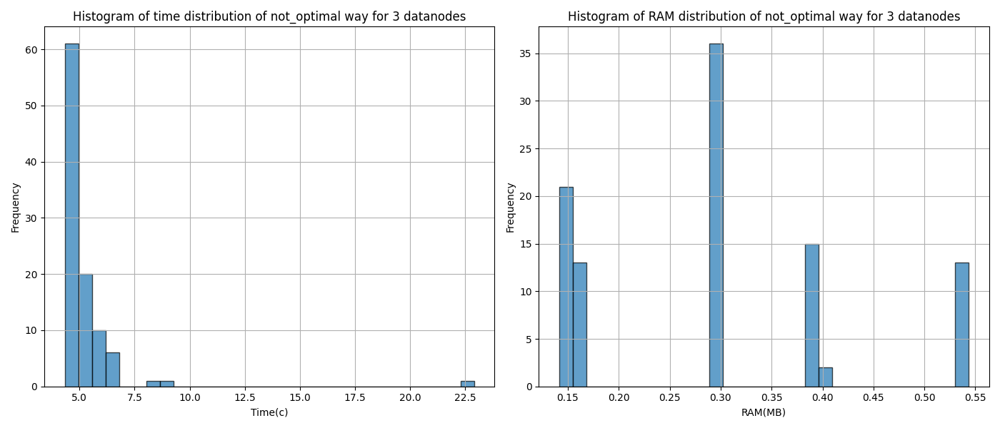
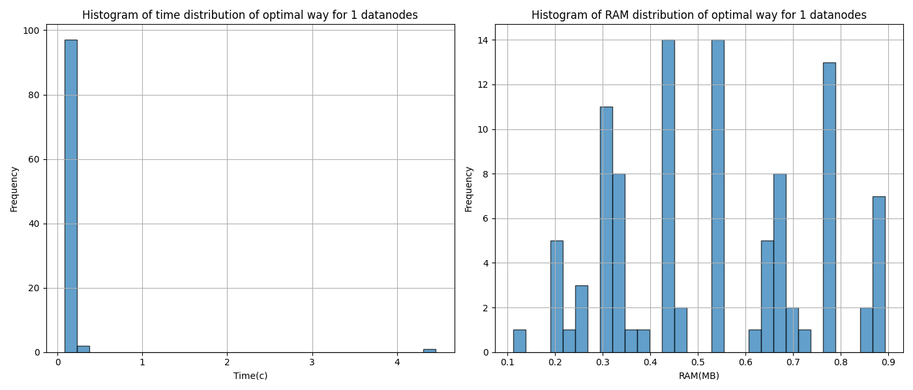
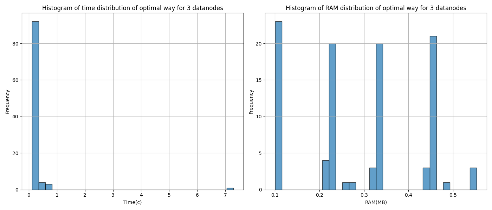

## Preliminaries

Основная задача, которая решается работой приложений - это обучение Random Forest классификатора на данных для предсказания наличия или появления диабета на основе других факторов. 

Файл `data/diabetes_prediction_dataset.csv` содержит медицинские и демографические данные пациентов, а также информацию о наличии или отсутствии у них диабета. В нем представлены различные характеристики, такие как возраст, пол, индекс массы тела (BMI), гипертония, сердечные заболевания, история курения, уровень HbA1c и уровень глюкозы в крови. Этот датасет можно использовать для построения моделей машинного обучения, которые могут предсказывать вероятность диабета у пациентов на основе их медицинской истории и демографических данных.

[Ссылка на данные](https://www.kaggle.com/datasets/iammustafatz/diabetes-prediction-dataset/data)

Внутри приложения мы делаем три шага: преобразуем данные,например делаем декатегоризацию и приводим к стандартным типам числовые значения, обучаем классификар и оцениваем его.

```
df = data_preprocess(df)
predictions = train_process(df)
accuracy = evaluate(predictions)
```


## Time and RAM consuming

Ниже представлены результаты, сколько времени и памяти на 100 итераций занимает такая операция обучения и оценки в обычном (не оптимизированном) и распараллеленом (оптимизированном) виде






## Note

Результаты и код работы был запущен на компьютере Mac Book M1 pro, и файлы контейнера для других операционных систем возможно будет необходимо изменить.

## With 1 datanode

Чтобы запустить это приложение с одной датанодой, нужно сначала поднять соответствующий контейнер.

```
docker-compose -f docker-compose.yml up -d
```

Затем необходимо загрузить данные в hdsf, для этого зайдем в поднятый докер, скопируем туда датасет из `data` и положим в hdfs:

```
docker cp data/diabetes_prediction_dataset.csv namenode:/ 

docker exec -it namenode bash

hdfs dfs -put diabetes_prediction_dataset.csv /
```

Чтобы запустить приложения, для начала добавим необходимые скрипты из `src` на контейнер `spark-master`: 
```
docker cp -L src/. spark-master:/opt/bitnami/spark/
```
Запустим командой ниже процесс обучения в кол-ве 100 итераций и отрисовку графиков. Через `--data-path` указываем путь к файлу в hdfs.

`app.py` для неоптимизированного приложения:
```
docker exec -it spark-master spark-submit --master spark://spark-master:7077 app.py --data-path hdfs://namenode:9000/diabetes_prediction_dataset.csv
```
`app_optimal.py` для оптимизированного: 
```
docker exec -it spark-master spark-submit --master spark://spark-master:7077 app_optimal.py --data-path hdfs://namenode:9000/diabetes_prediction_dataset.csv
```

Чтобы достать графики и положить их в `images`, введем две команды:

```
docker cp spark-master://opt/bitnami/spark/optimal_with_1_datanodes.png images

docker cp spark-master://opt/bitnami/spark/not_optimal_with_1_datanodes.png images
```

## With 3 datanodes
Чтобы протестировать с тремя нодами после предыдущего шага сначала опустить текущие контейнеры и поднимем для 3-ех нод:

```
docker-compose -f docker-compose.yml down

docker-compose -f docker-compose-3d.yml up -d
```

Проверим, что данные лежат в hdfs. 

```
docker exec -it namenode bash

hdfs dfs -ls / # тут должен лежать diabetes_prediction_dataset.csv файл
```

Если его нет - смотреть with 1 datanode

Так же скопируем необходимые скрипты из `src` на контейнер `spark-master`: 

```
docker cp -L src/. spark-master:/opt/bitnami/spark/
```

И запустим команды

`app.py` для неоптимизированного приложения:
```
docker exec -it spark-master spark-submit --master spark://spark-master:7077 app.py --data-path hdfs://namenode:9000/diabetes_prediction_dataset.csv --datanodes 3
```
`app_optimal.py` для оптимизированного: 

```
docker exec -it spark-master spark-submit --master spark://spark-master:7077 app_optimal.py --data-path hdfs://namenode:9000/diabetes_prediction_dataset.csv --datanodes 3
```

Достанем графики: 

```
docker cp spark-master://opt/bitnami/spark/optimal_with_3_datanodes.png images

docker cp spark-master://opt/bitnami/spark/not_optimal_with_3_datanodes.png images
```